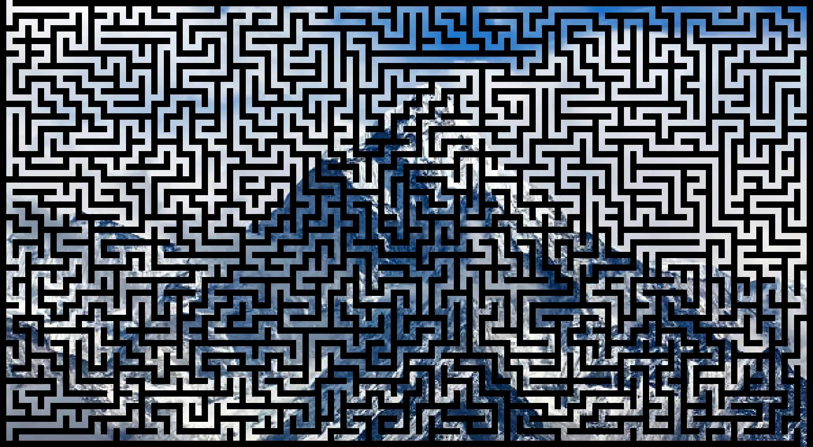
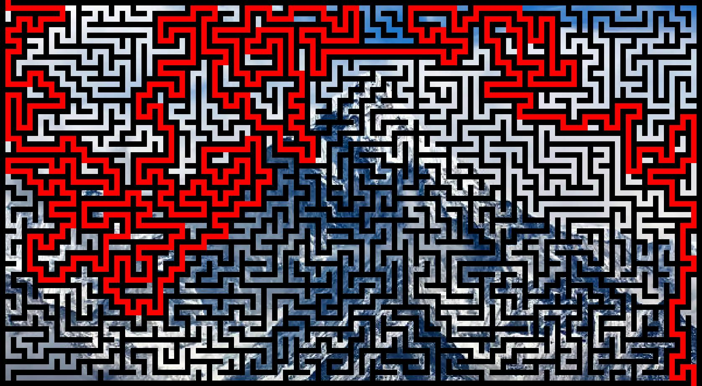

# maze_generator

## About

Create a maze into a image and solve it.

## How to use it

``` sh
python maze_generator_image.py image.jpg
```

> [!NOTE]
> Image have to be an jpg image.

## dependencies

- Pillow: Can be installed using `pip install pillow`

## Visual example





